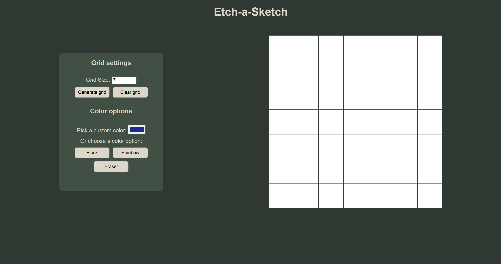

# Etch-a-Sketch 

A browser-based digital sketchpad inspired by the classic Etch-a-Sketch toy. Built to practice **DOM manipulation** and **Flexbox layout** skills as part of The Odin Project's Foundations course.

## Project Overview

This project lets users draw by hovering over a grid of squares, changing their color to simulate sketching. Users can also resize the grid dynamically with a button prompt.

### Core Features

- ✅ Dynamically generated **16x16 grid** using JavaScript.
- ✅ **Flexbox layout** to simulate a uniform grid.
- ✅ Hover effect: squares change color as the mouse passes over.
- ✅ A **reset button** that allows users to input a new grid size (up to 100x100).
- ✅ Responsive resizing of squares to fit within a 960px container.

### Extra Credit Features

- **Random RGB color** generation on hover.
- **Progressive darkening** effect using opacity—each hover darkens the square by 10%.

## Getting Started

1. **Clone the repository**:
   ```
   git clone https://github.com/constantin-catalina/odin-etch-a-sketch.git
   ```
2. **Navigate to the project folder**:
   ```
   cd etch-a-sketch
   ```
3. **Open index.html in your browser**:<br>
You can use Live Server in VS Code or simply double-click the file.

## Preview


## License
MIT License - free for educational and personal use
